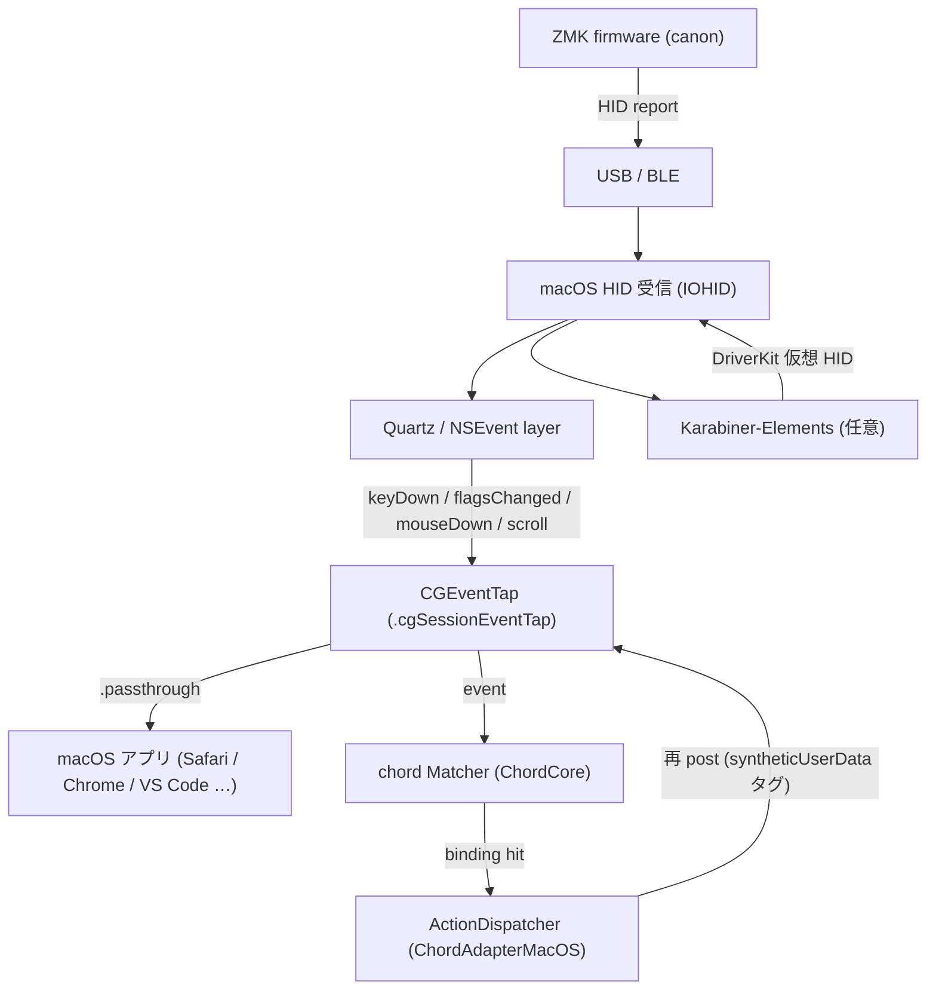
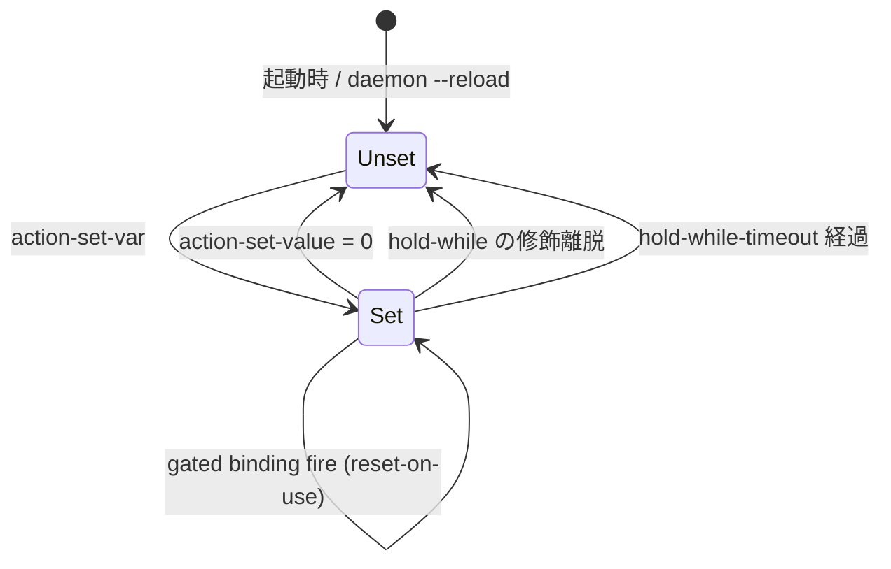
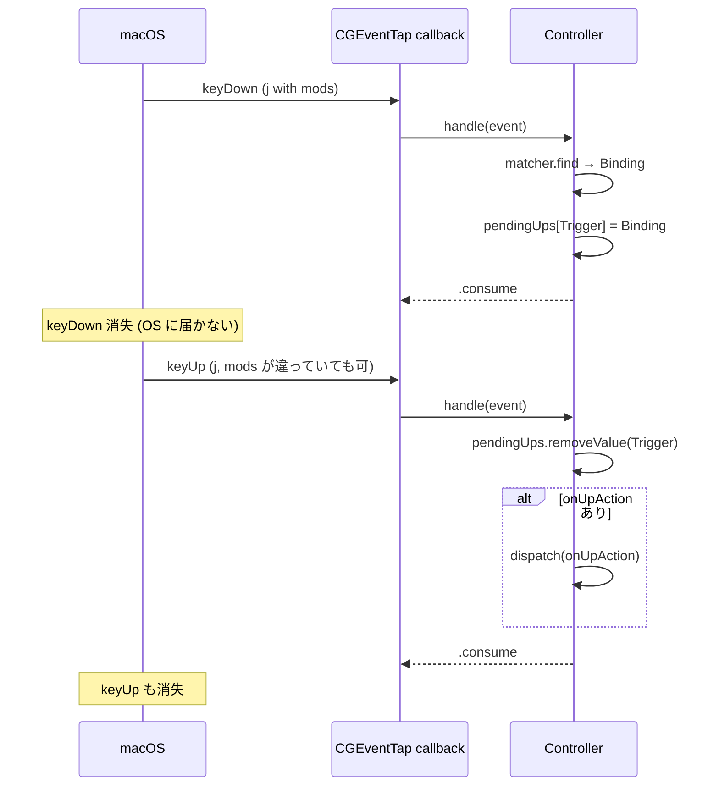

# chord ユビキタス言語 — Glossary

chord プロジェクトの **正規 (canonical) 用語表**。設計議論・PR レビュー・
コードコメント・ドキュメント全てで、このファイルの用語と表記に従う。

同じ概念を別の名前で呼ぶ揺れ ("alias" だけで input/action のどちらか不明、
"state-store" と "variables" が混在、等) が起きるたびに合意コストが膨らむ。
それを根本的に潰すための辞書。

## 運用ルール

1. **コード変更時に用語を新設 / rename / 意味変更したら、同 PR で本書を更新**
   (PR template の checkbox に従う)。
2. **schema 契約** (`docs/schema/chord.bindings.v3.json`) の enum は
   **値の追加は forward-compatible**、既存値の rename は schema version
   bump の合図。
3. **英名 = コード識別子と 1:1** を維持。Swift 型は CamelCase、TOML token
   は kebab-case のまま使う。**説明は日本語**。
4. 「**Don't call it:**」欄は **PR レビューでの即時 NG ワード**。コメントで
   指摘するときの根拠にしてよい。

---

## アーキテクチャ層

chord は **CGEventTap (Quartz の上)** に位置する。上下に隣接する層との
関係を最初に視覚化しておく:



- **ZMK firmware** は chord の上流 (= "atomic chord" emitter)。詳細は §6
- **CGEventTap** は chord の入口かつ出口 (post 後にも再入する)。詳細は §5
- **Matcher** / **Action** / **Binding** は ChordCore の純粋ロジック。詳細は §1

---

## 1. Core types (Swift)

### Modifiers

UInt16 `OptionSet` で表現される修飾キー集合。**2 層構造**:

- **any-side** (`.cmd`, `.opt`, `.ctrl`, `.shift`, `.fn`): L/R 不問
- **strict-side** (`.lcmd`, `.rcmd`, `.lopt`, `.ropt`, `.lctrl`, `.rctrl`,
  `.lshift`, `.rshift`): 片側必須
- **`.hyper`** は `cmd + opt + ctrl + shift` の sugar (any-side のみ)

**Event 側は strict-side ビットのみ運ぶ**。any-side は binding 側にしか
立たない (matcher の `matches(event:)` で柔軟マッチ)。

`isStillHeld(in:)` は `matches(event:)` と別物で、`hold-while`
ライフサイクル用に **余分な修飾を許容**する。

- code: [Sources/ChordCore/Models.swift](../Sources/ChordCore/Models.swift) `Modifiers`
- schema: `modifier_token` / `modifier_sides` (frozen)
- **Don't call it**: modifier-mask, modifier-set (説明文の語句としては可、
  概念名としては Modifiers)

### Trigger

binding を発火させる **入力イベントの種別**。代数的データ型:

- `.key(UInt16)` — キーボードのキー (keycode)
- `.mouseButton(MouseButton)` — マウスボタン
- `.scroll(ScrollDirection)` — スクロールホイール方向
- `.anyKey` — wildcard。**[[fallbacks]] でだけ legal**
- `.modifiersOnly` (chord 0.9.0+) — primary key を持たず、修飾 mask の entry/exit transition で発火
- `.vkey(UInt8)` (chord 0.10.0+) — vendor-HID v-key。canon が `&vkey <id>` で
  送る selector id (1–255)。修飾子を持たず、[`[v-key-aliases]`](#sections) の
  名前で bare `input = "NAME"` 参照する。詳細は §5 [VKeyHIDSource](#vkeyhidsource) / §6
- `.anyVKey` (chord 0.10.0+) — v-key 版 wildcard (`input = "v-key"`)。
  **[[fallbacks]] でだけ legal**。未割当の全 v-key にマッチ

- code: [Sources/ChordCore/Models.swift](../Sources/ChordCore/Models.swift) `Trigger`
- schema: `trigger.kind` (frozen — §3)
- **Don't call it**: input (config の TOML key と紛らわしい), primary-token。
  v-key の概念名は **v-key**（hyphen 付き・TOML/prose）、コード識別子は **vkey**
  (`Trigger.vkey` / `VKeyHIDSource`)。"original key" は説明語であって概念名ではない

### MouseButton / ScrollDirection

| 型 | 値 |
|---|---|
| `MouseButton` | `left`, `right`, `middle`, `side1`, `side2`, `other5`, `other6`, `other7` |
| `ScrollDirection` | `up`, `down`, `left`, `right` |

`side1` / `side2` は通常マウスの "back" / "forward" ボタンを指す。

- code: [Sources/ChordCore/Models.swift](../Sources/ChordCore/Models.swift)

### Action

binding が hit したときの **副作用**。

| ケース | 動作 |
|---|---|
| `.keys(Modifiers, UInt16)` | 合成キーイベントを post |
| `.shell(String)` | `/bin/zsh -l -c` でコマンド実行 |
| `.noop` | イベントを吸収するだけ |
| `.setVariable(name, value)` | state-var を書き換え |
| `.toggleVariable(name)` | state-var を 0↔1 反転 (chord 0.9.0+) |

binding は `action` 1 つに加えて **`extraDownActions[]`** を持つ
(v0.4.0+、`action-shell + action-keys` 同時発火)。

- code: [Sources/ChordCore/Models.swift](../Sources/ChordCore/Models.swift) `Action`
- schema: `action.kind` (frozen — §3)
- **Don't call it**: action-kind (TOML config の `action-*` プレフィックス
  と混同を招くので、概念名は Action)

### Condition

binding を発火させる **state ゲート述語**。2 形:

- `.variable(name: String, equals: Int)` — 単一変数等価 (v2)
- `.conjunction([Condition])` — 2 件以上の AND ゲート (chord 0.9.0+)。
  `when-vars = { a = 1, b = 2 }` inline-table から生成。wire では
  `kind: "all"` + 再帰 `conditions[]` として出力。

OR / NOT は意図的に対象外 (式文法化を避ける)。`a == 1 && b == 2` を
将来検討としていた issue #19 は `when-vars` 出荷で解消済。

- code: [Sources/ChordCore/Models.swift](../Sources/ChordCore/Models.swift) `Condition`
- **Don't call it**: state-predicate, when-var-clause

### Binding

trigger + modifiers + optional `apps` → action の **1 行**。
runtime フィールド (`action`, `condition`, `holdWhile`,
`holdWhileTimeoutMs`, `onUpAction`, `extraDownActions`,
`inputSource`, `passthrough`, `repeatStrategy` — 後 3 つは chord
0.9.0+) と metadata フィールド (`inputRaw`, `actionRaw`,
`aliasName`, `sourceLine`) を持つ。

metadata は **Matcher が無視** し、`config --show --json` だけが使う。

- code: [Sources/ChordCore/Models.swift](../Sources/ChordCore/Models.swift) `Binding`

### StateSnapshot

[VariableStore](#variablestore) の `[String: Int]` 変数ストアの
**値型コピー**。tap スレッドが lock-free に読むため、Event に乗せて渡す。
**unset == 0**。

- code: [Sources/ChordCore/Models.swift](../Sources/ChordCore/Models.swift) `StateSnapshot`
- **Don't call it**: state-dict, state-store (それは容器の概念)

### ChordConfig / ChordConfig.Options

`config.toml` を読んだ結果の **whole-program 設定**。

```
ChordConfig
├── options          (passthroughUnmatched, excludeApps, fnAutoArrows)
├── bindings         [Binding]
├── fallbacks        [Binding]   ← trigger に .anyKey を許す
├── actionAliases    [String: String]
└── inputAliases     [String: String]
```

`fnAutoArrows` (chord 0.8.0+): true (default) のとき、arrow / nav キー
([KeyCodes.fnAutoNavKeycodes](../Sources/ChordCore/KeyCodes.swift) の 9 key)
の matching で `fn` 比較をスキップする。macOS が arrow に常に
`NSEventModifierFlagFunction` を付与する都合への対応。

- code: [Sources/ChordCore/Models.swift](../Sources/ChordCore/Models.swift) `ChordConfig`

---

## 2. Config concepts (TOML レイヤ)

ユーザが `config.toml` に書くトークン群。全て **frozen** (rename は schema major bump = v4)。

### Sections

| Section | 役割 |
|---|---|
| `[options]` | グローバル設定 (`passthrough-unmatched`, `exclude-apps`, `fn-auto-arrows`)。chord 0.9.0+ では未知キーが `unknown-option-key` warning で surface する (silent drop しない) |
| `[[bindings]]` | 通常 binding (document order, first-match-wins) |
| `[[fallbacks]]` | bindings が全 miss した時だけ評価される binding 群。`*` ワイルドカードが許される唯一の場所 |
| `[[sequence]]` | leader-key 用 sugar (chord 0.7.0+)。`prefix` + 子 `[[sequence.bindings]]` + `timeout-ms` から **state-var binding 群に parse 時展開**。詳細は §4 [sequence (leader-key sugar)](#sequence-leader-key-sugar) |
| `[[remap]]` | 1 対 1 リマップ用 sugar (chord 0.8.0+)。`modifiers` + `map = { k1 = "a", k2 = "b" }` から N 個の `.keys` binding に parse 時展開 |
| `[[bindings.per-app]]` | per-OS 分岐 sugar (chord 0.8.0+)。`[[bindings]]` 親に nested AoT で N 個の per-app 子を書き、各子は `apps = [bundle-id]` 付きの binding に展開 |
| `[action-aliases]` | `@name → shell command` の置換テーブル |
| `[input-aliases]` | `$name → "mod1 + mod2"` の置換テーブル |
| `[v-key-aliases]` | `NAME → vendor-HID id (1–255)` の置換テーブル (chord 0.10.0+)。binding は bare `input = "NAME"` で参照（`$` 無し）。名前は大小無視・first-wins、builtin key/modifier/`v-key` wildcard を shadow すると reject |

### Per-binding fields

| Token | 意味 | 備考 |
|---|---|---|
| `input` | trigger + modifiers の文字列表現 | `"$ULTRA_LL - c"` `"mouse.side1"` `"ctrl - scroll.up"` |
| `action-shell` | shell command | `@name` で alias 参照 |
| `action-keys` | 合成キー文字列 | `"cmd + shift - tab"` |
| `action-noop` | true で吸収のみ | |
| `action-set-var` | 書き換える変数名 | |
| `action-set-value` | 書き込む値 (省略時 1, 0 で clear) | |
| `action-toggle-var` | 押すたび 0↔1 反転 (chord 0.9.0+) | 値・hold-while* 系・on-up と相互排他 |
| `action-hold-var` | down で 1, paired up で 0 を自動 set (chord 0.9.0+) | 暗黙の on-up を所有、他の on-up と相互排他 |
| `action-mission-control` | `"show-all-windows"` / `"show-app-windows"` (chord 0.9.0+) | macOS default shortcut (Ctrl+↑ / Ctrl+↓) に desugar |
| `action-screenshot` | `"selection"` / `"screen"` (chord 0.9.0+) | macOS default (Cmd+Shift+4 / Cmd+Shift+3) に desugar |
| `action-spotlight` | `true` で Spotlight 起動 (chord 0.9.0+) | macOS default (Cmd+Space) に desugar |
| `when-var` | 発火を gate する変数名 | 等価値は `when-var-value` (省略時 1) |
| `when-vars` | 複数変数 AND ゲート (chord 0.9.0+) | `{ a = 1, b = 2 }` inline-table。`when-var` と相互排他、1 要素は `.variable` に collapse |
| `hold-while` | 修飾保持中だけ var 維持 | `hold-while-timeout` と相互排他 |
| `hold-while-timeout` | inactivity ms 経過で var clear | `hold-while` と相互排他 |
| `action-*-on-up` | 対の key-up で発火する action | `action-keys-on-up` 等 |
| `apps` | bundle id glob 配列 | `["*"]` は nil 扱い、`"!com.example"` で除外 |
| `input-source` | macOS keyboard input source id glob 配列 (chord 0.9.0+) | `apps` と同じ semantics、string 単独形は 1 要素配列に sugar |
| `passthrough` | `true` で原イベントを OS にも流す (chord 0.9.0+) | `action-shell` / `action-set-var` / `action-toggle-var` のみ可、`action-keys` / `on-up` / `noop` とは相互排他 |
| `repeat` | typematic autorepeat 戦略 (chord 0.9.0+) | `"fire-each"` (default) / `"ignore"` (1回のみ発火) / `"passthrough"` (発火後は OS に流す) |

### Reference syntax

| 記法 | 意味 | 出現場所 |
|---|---|---|
| `@name` | action-alias 参照 (引数なし alias 用) | `action-shell` の値 |
| `@name(arg1, "arg 2")` | action-alias 引数付き (chord 0.9.0+)。alias body の `{{1}}` `{{2}}` …プレースホルダに **literal 置換** (escape なし、quote はユーザ責任) | `action-shell` の値 |
| `$name` | input-alias 参照 | `input` の値 |
| `NAME` (bare) | v-key-alias 参照（`$` 無し、それ単体で完結トリガ） | `[[bindings]]` / `[[fallbacks]]` の `input` |
| `*` | wildcard primary key | `[[fallbacks]]` の `input` のみ |
| `v-key` / `vkey` | any-vkey wildcard (`.anyVKey`) | `[[fallbacks]]` の `input` のみ |
| `keycode-NN` | 生 `CGKeyCode` の脱出口 | `input` / `action-keys` の key 部 |

**Don't call it**:
- `[action-aliases]` ↔ `[input-aliases]` を bare "alias" と呼ばない。**必ず
  "input" / "action" を冠する**。混同が頻発する。
- `[aliases]` (v0.5 までの旧名) は dead — `[action-aliases]` を使う。
- `$prefix` は記法名 (alias 参照の構文) であって概念名ではない。概念名は
  **input-alias**。
- `[v-key-aliases]` ↔ `[input-aliases]` を混同しない。前者は **vendor-HID id**
  への名前付け（bare 参照）、後者は **修飾子セット**への名前付け（`$` 参照）。

---

## 3. Schema enum values (frozen)

`docs/schema/chord.bindings.v3.json` の enum 値 (v1 は history 用に残置; v2 は別ファイル未発行)。
**rename はすべて schema major bump**。新規追加は forward-compatible (既存 consumer
が unknown を許容する前提)。

### `trigger.kind`

| 値 | 意味 |
|---|---|
| `"key"` | キーボードキー (carries keycode) |
| `"mouseButton"` | マウスボタン |
| `"scroll"` | スクロールホイール |
| `"anyKey"` | wildcard ([[fallbacks]] 専用) |
| `"modifiersOnly"` | primary key 無しの修飾 mask 専用トリガ (chord 0.9.0+) |
| `"vkey"` | vendor-HID v-key。`name` = `"0x%02X"`、`keycode` = id (1–255) (chord 0.10.0+) |
| `"anyVKey"` | v-key 版 wildcard ([[fallbacks]] 専用) (chord 0.10.0+) |

### `action.kind`

| 値 | 意味 |
|---|---|
| `"keys"` | 合成キー post |
| `"shell"` | shell command |
| `"noop"` | 吸収のみ |
| `"set-variable"` | state-var 書き換え (v2+) |
| `"toggle-variable"` | state-var を 0↔1 反転 (chord 0.9.0+, [action-toggle-var]) |

### `modifier_sides`

| 値 | 意味 |
|---|---|
| `"absent"` | 両側 unpressed |
| `"any"` | どちらかの側が held |
| `"left"` | 左側のみ |
| `"right"` | 右側のみ |
| `"both"` | 両側 held |

### `modifier_token`

any-side: `"cmd"`, `"opt"`, `"ctrl"`, `"shift"`, `"fn"`
strict-side: `"lcmd"`, `"rcmd"`, `"lopt"`, `"ropt"`, `"lctrl"`, `"rctrl"`, `"lshift"`, `"rshift"`

### `ConfigWarning.Kind`

| 値 | 発生条件 |
|---|---|
| `"config-not-found"` | config ファイル欠如 (非致命) |
| `"missing-input"` | binding 行に `input` 欠如 |
| `"missing-action"` | binding 行に action-* 欠如 |
| `"unknown-input-token"` | 修飾/キー名の typo |
| `"action-keys-parse-error"` | `action-keys` 文字列パース失敗 |
| `"action-alias-non-string"` | `[action-aliases]` の値が non-string |
| `"undefined-action-alias"` | `@name` が `[action-aliases]` にない |
| `"input-alias-non-string"` | `[input-aliases]` の値が non-string |
| `"input-alias-shadows-modifier"` | alias 名が builtin modifier と衝突 |
| `"input-alias-invalid-body"` | `[input-aliases]` の値がパース不能 |
| `"undefined-input-alias"` | `$name` が `[input-aliases]` にない |
| `"condition-parse-error"` | `when-var` 不正 |
| `"hold-while-parse-error"` | `hold-while` / `hold-while-timeout` 不正 |
| `"action-set-parse-error"` | `action-set-var` / `action-set-value` 不正 |
| `"sequence-parse-error"` | `[[sequence]]` 行不正、または regular binding が sequence prefix と衝突 (chord 0.7.0+) |
| `"remap-parse-error"` | `[[remap]]` 行不正 (modifiers 欠如・map 非 inline-table・値 non-string 等) (chord 0.8.0+) |
| `"per-app-parse-error"` | `[[bindings.per-app]]` 行不正 (bundle-id 欠如、`apps` と相互排他違反) (chord 0.8.0+) |
| `"action-alias-call-error"` | `@name(args)` の引数不足・arg 解析失敗 (chord 0.9.0+) |
| `"unknown-option-key"` | `[options]` 内に既知でないキー (typo 検出。chord 0.9.0+) |
| `"unknown-key"` | `[[bindings]]` / `[[fallbacks]]` / `[[sequence]]` / `[[remap]]`（および nested `per-app` / `sequence.bindings`）行に descriptor 未知のキー (typo: `actoin-shell` 等)、**または top-level section header 自体の typo (`[[bindigs]]` / `[optoins]`)**。いずれも runtime は黙って無視・`--strict` で exit 1。既知目録 (section 名 + 各 section のキー) は `--emit-schema` を駆動する `ChordConfigSchema` descriptor と同一 (#52-bounded) |
| `"duplicate-binding-name"` | ユーザ命名の `[[bindings]]` 行が同名で複数 (synth `binding-N` 名は除外) |
| `"v-key-alias-invalid"` | `[v-key-aliases]` の値が非整数 / 範囲外 (1–255 外) / 名前が builtin key・modifier・`v-key` wildcard を shadow (chord 0.10.0+) |
| `"other"` | 将来の catch-all |

---

## 4. State lifecycle

v2 state machine は **flat `[String: Int]` + 単一変数等価（または
`when-vars` AND 連言）** という narrow な surface。寿命の選択肢は 3 つ:



### state-var

`VariableStore` の `[String: Int]` ストアのエントリ。**unset = 0**。
`Condition.variable(name, equals: 0)` で "mode cleared" を表現するのが
イディオム。書き込みは `action-set-var` (+ `action-set-value`) /
`action-toggle-var` で行う。

ストア本体は **ChordCore の [VariableStore](#variablestore)** が所有し、
Controller が tap スレッドから driveする (`set` / `toggle` / `snapshot` /
`clearStale` / `extendTimer` / `reset`)。

- code: [Sources/ChordCore/VariableStore.swift](../Sources/ChordCore/VariableStore.swift) `VariableStore`
- **Don't call it**: variable (一般語で衝突しがち), state-store (容器名
  としては可、概念名としては state-var)

### hold-while-modifier-bound

`hold-while = "cmd + opt"` 形式で **OS の修飾保持に変数寿命を紐づける**。
modifier が全部離れた時点で var が clear される。`Modifiers.isStillHeld(in:)`
は permissive (余分な修飾を許容) なので、shift を追加で押したくらいでは
解除されない。

### hold-while-timeout

`hold-while-timeout = 1500` 形式で **inactivity timer** に変数寿命を紐づける。
gated binding が発火するたびタイマー reset (= **reset-on-use / B-α**)。

ZMK macro が atomic emit する都合で modifier を即座に離す場合、`hold-while`
だと寿命が一瞬で尽きるので、**timeout 系列が canon 用途では実用解**。

### reset-on-use (B-α)

Vim の `timeoutlen` セマンティクス。`when-var` で gate される binding が
発火するたびに `hold-while-timeout` のタイマーが reset される運用。
**chord 0.4.0 で採用**。

### sequence (leader-key sugar)

`[[sequence]]` セクションは **prefix + 子 binding 群 + timeout-ms** を
1 ブロックで宣言し、parse 時に以下の通常 binding 群に展開する (chord 0.7.0+):

- **prefix binding**: `action-set-var = "_seq_<name>"`, `hold-while-timeout = <timeout-ms>` を持つ無条件 binding
- **子 binding**: `when-var = "_seq_<name>"` で gate された binding。`input` は **primary-only** で書き、prefix の modset を自動継承

```toml
[[sequence]]
name = "j-layer"
prefix = "$ULTRA_LL - j"
timeout-ms = 1500

  [[sequence.bindings]]
  input = "k"
  action-keys = "return"

  [[sequence.bindings]]
  input = "l"
  action-keys = "backspace"
```

Matcher / Controller は展開後の binding しか知らない (= 新しい runtime
概念は導入しない)。`_seq_` プレフィックスは **予約済み namespace** で、
ユーザ binding は `action-set-var = "_seq_..."` を書けない (load 時 reject)。

prefix が通常 `[[bindings]]` と `(trigger, modifiers)` 衝突する場合、
**通常 binding が drop され sequence が勝つ** (warning 付き)。

- code: [Sources/ChordCore/Config.swift](../Sources/ChordCore/Config.swift) `parseSequences`
- config: `[[sequence]]` + `[[sequence.bindings]]`
- runtime concept: なし (= ChordConfig.bindings に展開済み)
- **Don't call it**: leader, layer, modal-state (説明文では可、概念名は sequence)

### pendingUps

Controller の `[Trigger: Binding]` テーブル。`B1 contract` (paired
down/up consume) のための内部状態。down を consume したときに登録し、
対応する up が来たら entry を抜き取って `onUpAction` を発火 (あれば)、
up も consume。

**(Trigger, Modifiers) ではなく Trigger だけがキー**。ユーザが down と up
の間に修飾を離す (`cmd` 先に離して `j` を後で離す) ことが多く、event の
modifier mask は down と up で別物になり得るため。

- code: [Sources/ChordApp/Controller.swift](../Sources/ChordApp/Controller.swift) `pendingUps`
- **Don't call it**: pending-releases, up-queue, release-map

### paired down/up consume (B1 contract)



down を飲んだら up も飲む = OS に "phantom key-up" を残さない原則。
**modifier が down と up で食い違っても trigger が一致すれば pair を成立**
させるのがポイント。

---

## 5. Runtime / Adapter

macOS 層に降りた具体実装側の概念。

### CGEventTap

Quartz Core Graphics の event tap。chord は **`.cgSessionEventTap`** に
**head-insert** で取り付ける。mask は `keyDown | keyUp | flagsChanged |
mouseDown 系 | scrollWheel` を含む。

- code: [Sources/ChordAdapterMacOS/EventTap.swift](../Sources/ChordAdapterMacOS/EventTap.swift)
- **Don't call it**: tap-subsystem (具体性なし), event-tap (colloquial、
  文中の語句としてはよいが概念名は CGEventTap)

### syntheticUserData

ActionDispatcher が post する合成イベントに付ける **sentinel 値**
`0x43484F524400` (= ASCII "CHORD\0")。`kCGEventSourceUserData` に書く。
タップが再入時にこの値を見て **自前合成イベントを matcher 投入前に
short-circuit** する。これがないと無限ループ。

- code: [Sources/ChordAdapterMacOS/EventTap.swift:23](../Sources/ChordAdapterMacOS/EventTap.swift) `syntheticUserData`
- **Don't call it**: marker, tag (説明文では可、概念名は syntheticUserData)

### NX_DEVICE bits

`CGEventFlags` の raw value 内に潜む **device-dependent 修飾フラグ**
(L/R 区別)。`0x00000008` = lcmd 等、`IOKit/hidsystem/IOLLEvent.h` 由来。
chord はこれを読んで strict-side ビットを構築する (abstract mask だけ
立っていれば left をデフォルトに丸める)。

- code: [Sources/ChordAdapterMacOS/EventTap.swift](../Sources/ChordAdapterMacOS/EventTap.swift) `readModifiers`

### autorepeat (`kCGKeyboardEventAutorepeat`)

長押し中の連続 key-down を示す CGEvent フィールド。chord 0.9.0+ で
binding 単位の `repeat` プロパティ (= `Binding.repeatStrategy` /
[RepeatStrategy](../Sources/ChordCore/Models.swift)) として **出荷済**。
`"fire-each"` (default) / `"ignore"` (1 回のみ発火し repeat は consume) /
`"passthrough"` (発火後は repeat を OS に流す) の 3 択。

- code: [Sources/ChordCore/Models.swift](../Sources/ChordCore/Models.swift) `RepeatStrategy`

### frontmost

NSWorkspace が報告する **最前面アプリの bundle id**。binding の `apps`
フィルタはこれと glob 比較する。

- code: [Sources/ChordAdapterMacOS/FrontmostTracker.swift](../Sources/ChordAdapterMacOS/FrontmostTracker.swift)
- **Don't call it**: active-app, front-app

### AX permission (Accessibility grant)

CGEventTap が動くのに必須の権限。System Settings → Privacy & Security →
Accessibility で grant。**TCC はコード署名 identity に紐づく**ので、
ad-hoc 署名ではビルドのたびに grant が剥がれる
(`setup-signing-cert.sh` で永続 cert を作るのが対策)。

- code: [Sources/ChordAdapterMacOS/Permissions.swift](../Sources/ChordAdapterMacOS/Permissions.swift)
- **Don't call it**: a11y (colloquial だが説明文では可), accessibility
  (一般語、概念名としては AX permission)

### Input Monitoring (kTCCServiceListenEvent)

v-key の vendor-HID 読み取り (IOHIDManager) に必須の権限 (chord 0.10.0+)。
**AX permission とは別の TCC grant**。System Settings → Privacy & Security →
Input Monitoring で grant。`IOHIDCheckAccess(kIOHIDRequestTypeListenEvent)` で
check、`IOHIDRequestAccess(...)` で prompt。**v-key binding がある時だけ要求**
され (`Controller.maybeStartVKeySource`)、非 v-key ユーザには求められない。
`config --doctor` の `input monitoring:` 行 / `query --status` の
`input_monitoring_granted` で可視化。AX を持っていても別途必要。

- code: [Sources/ChordAdapterMacOS/Permissions.swift](../Sources/ChordAdapterMacOS/Permissions.swift) `isInputMonitoringTrusted`
- **Don't call it**: listen-event grant (概念名は Input Monitoring), IM

### VKeyHIDSource

v-key を読む **IOHIDManager** ベースの入力源 (chord 0.10.0+)。dongle を
VID/PID (`0x1D50`/`0x615E`) で match し、report ID `0x20` の 1-byte selector
(canon vendor usage page `0xFF31`) **だけ**を読む。通常キーボード report は
読まない。selector `1–255` = press / `0` = release。**`EventSource` には
conform しない** (vendor report は tap に乗らず consume/pass の返値が無意味)。
edge 検出 (press / release の latch math) は ChordCore の純粋型
[VKeyEdgeTracker](#vkeyedgetracker) が持ち、`VKeyHIDSource` は生の
selector を流すだけ。

- code: [Sources/ChordAdapterMacOS/VKeyHIDSource.swift](../Sources/ChordAdapterMacOS/VKeyHIDSource.swift)
- schema: `trigger.kind = "vkey"` / `"anyVKey"` (§3)
- **Don't call it**: HID tap, vkey-tap (CGEventTap ではない), original-key-source

### VKeyEdgeTracker

v-key の press/release **edge / latch math** を持つ ChordCore の純粋型
(unit-test 済)。release report は id を持たないので、どの `.vkey(id)` の
`.up` を合成するかを latch で覚える。同 id の連続は無視、`A → B` roll は
A を release してから B を press。Controller は raw selector を
`events(for:)` に渡すだけで、HID 依存コードは持たない。

- code: [Sources/ChordCore/VKeyEdgeTracker.swift](../Sources/ChordCore/VKeyEdgeTracker.swift) `VKeyEdgeTracker`
- **Don't call it**: vkey-state-machine

### VariableStore

state-var ストアの本体 (chord 0.10.0 era で Controller の file-private
globals から抽出)。**ChordCore が所有・Controller が drive**。flat
`[String: Int]` を自前の `NSLock` で守る `final class` (`@unchecked
Sendable`)。`snapshot()` (tap スレッド読み) / `set(name:value:holdWhile:
timeoutMs:)` / `toggle(name:)` (単一 lock window で 0↔1) / `extendTimer
(name:)` (B-α reset-on-use) / `clearStale(currentMods:)` (修飾離脱
cleanup) / `reset()` (reload wipe) を公開。B-α inactivity timer は注入
された `StateScheduler` 経由 (production は `"chord.state.timer"` 直列
queue 上の `DispatchSourceTimer`)。**actor に置き換えてはいけない** —
tap スレッドは `await` できない。

- code: [Sources/ChordCore/VariableStore.swift](../Sources/ChordCore/VariableStore.swift) `VariableStore`
- **Don't call it**: state-machine, variable-actor

### EventSource

ChordCore と Adapter の seam (シーム) になる **callback ベース** プロトコル。
AsyncStream にしてはいけない (tap callback は同期返却が必須)。

- code: [Sources/ChordCore/EventSource.swift](../Sources/ChordCore/EventSource.swift)
- **Don't call it**: input-source (macOS の IME を指す既存語と衝突, issue
  #30 で別用途で使う)、event-driver

### DNC (Distributed Notification Center)

macOS の IPC チャネル `com.chord.app.control`。client → daemon に reload /
quit / pause / resume を fire-and-forget で送る。**返答経路がない**ので、
daemon 側の status は `/tmp/chord.status` ファイル経由で読む。

- code: [Sources/ChordApp/Control.swift](../Sources/ChordApp/Control.swift)
- **Don't call it**: dnc (略しても可だが正式は DNC)

---

## 6. ZMK / canon side

chord の上流 (= キーボード firmware) で出てくる名前。chord の config の
中にもそのまま現れるので、glossary に載せる。

### canon

ユーザの ZMK firmware リポジトリ
([akira-toriyama/canon](https://github.com/akira-toriyama/canon))。
Cyboard Imprint split keyboard 用。chord 設定の出元 (例: 4 modset の名前は
canon の `eiji_macros.dtsi` に由来)。

### &vkey / v-key (vendor-HID)

canon の ZMK behavior `&vkey <id>` (chord 0.10.0+)。既存のどのキー入力とも
衝突しない vendor usage page (`0xFF31` / report ID `0x20`) で 1-byte selector
(id 1–255) を送出する「オリジナルキー」。chord 側は §1 `.vkey(UInt8)` トリガ +
§5 [VKeyHIDSource](#vkeyhidsource) で受ける。canon の `config/vkey-aliases.toml`
(`scripts/gen-vkey-aliases.py` がキーマップの `&vkey <id>` から生成＝単一ソース)
が `[v-key-aliases]` ブロックを供給し、ユーザがそれを chord config に貼る。
chord にとっては入力源で、命名 (`TU_LL_C` 等) は canon 由来。

- **Don't call it**: original key (説明語。概念名は v-key), custom keycode

### ULTRA_LL / MIRACLE_LM / MEGA_RM / WONDER_RR

ZMK macro 名 4 種。それぞれ右側 3 修飾の異なる組み合わせ:

| Macro | 修飾セット |
|---|---|
| `ULTRA_LL` | `rctrl + ralt + rshift` |
| `MIRACLE_LM` | `rctrl + rcmd + rshift` |
| `MEGA_RM` | `rctrl + rcmd + ralt` |
| `WONDER_RR` | `rcmd + ralt + rshift` |

`private_config.toml` の `[input-aliases]` で論理名化されている。

### atomic chord

ZMK macro 等が **修飾 + primary key を 1 HID report に詰めて発信**する
振る舞い。primary を離した直後に修飾も離れるので、chord 側から見ると
**修飾保持時間が 1-2ms** しかない。`hold-while` ベースの v2 lifecycle が
使えない直接の原因 = `hold-while-timeout` を作る動機。

### F21-F24 (HID 0x70-0x73)

Apple が `kVK_*` 定数を割り当てていないキー。Karabiner / 一部 firmware
remapper の慣習で HID usage `0x70-0x73` に対応する keycode を使う。chord は
これを **受信側のみ** サポート (発信は CGEvent の制約で不能、issue I (skip)
参照)。

### ZMK macro

ZMK firmware で複数 HID 出力を 1 トリガに束ねる仕組み。chord にとっては
"入力源" であって chord 内部の概念ではない (= chord docs で頻出するが
chord 用語ではない)。

---

## 7. CLI / lifecycle

yabai 式 `chord <domain> --<verb> [--mod]`（atelier Phase 3 M4）。bare `chord` は daemon を起動。
`--help`/`-h`・`--version`/`-V` は domain 不要の top-level carve-out。

### `config` domain（standalone・daemon 不要）

| Verb | 動作 | Exit code |
|---|---|---|
| `config --validate` | config をパース、warning/drop を報告 (`--strict` / `--json` 受理) | 0 / 1 (strict + issues) / 2 (parse error) |
| `config --show` | 現行パース結果を出力 (`--json` / `--include-dropped` 受理・旧 `--list`) | 0 / 2 |
| `config --doctor` | validate + AX 権限 + daemon liveness | 0 / 1 (何か NG) |
| `config --emit-schema` | config.toml の INPUT JSON Schema (Draft-07) を stdout に（taplo 補完用・`ChordConfigSchema` descriptor から生成。committed copy は `chord config --emit-schema > config.schema.json` で再生成） | 0 |

### `daemon` domain（lifecycle・大半は DNC で daemon と通信・no daemon は exit 3）

| Verb | 動作 | Exit code |
|---|---|---|
| `daemon --reload` | config 再読込を要求 (`--dry-run` で IPC せず diff のみ) | 0 / 3 (no daemon) |
| `daemon --quit` | daemon 停止 | 0 / 3 |
| `daemon --pause` / `daemon --resume` | 全 binding を passthrough に / 復帰 | 0 / 3 |
| `daemon --toggle` | `/tmp/chord.status` を見て pause/resume を反転 | 0 / 3 |
| `daemon --show` | `/tmp/chord.status` の中身を print（旧 `--status`） | 0 / 3 |
| `daemon --watch` | live per-event trace — `/tmp/chord-watch.log` を truncate して `tail -F`、daemon は存在する間だけ書く | 0 / 1 (spawn 失敗) |
| `daemon --resign` | brew sandbox 後の Chord.app 再署名 + 再起動（DNC ではなく codesign + restart） | 0 (署名成功なら) |

### `query` domain（live runtime 状態を JSON で・daemon 必須・no daemon は exit 3）

DNC（write-only）や status file と別の **AF_UNIX req/res socket**（`/tmp/chord-query.sock`）越しに daemon の生状態を読む structured-read 口。出力は常に `chord.query.v1` JSON（parse 済 config の `chord.bindings.v3` とは別物）。

| Verb | 動作 | Exit code |
|---|---|---|
| `query --status` | live state（paused / ax-granted / uptime / config-loaded-at） | 0 / 3 (no daemon) |
| `query --vars` | 現在の state-variable 値 | 0 / 3 |
| `query --loaded-bindings` | binding / fallback / alias の件数 | 0 / 3 |
| `query --recent-fires [--limit N]` | 最近 fire した binding（新しい順・`--limit N` で件数上限＝chord 唯一の value-taking modifier） | 0 / 3 |

### Dispatch contract (chord 0.9.0+)

`dispatch(_:)` が先頭トークン（domain noun）を peel し、`config` / `daemon` / `query` の per-domain verb テーブル
(`configVerbs` / `daemonVerbs` / `queryVerbs`) へ `dispatchDomain` で routing する (`Sources/ChordApp/Main.swift`)。共有 tokenizer
**sill `CLIKit`** が argv を解析（未知 flag は loud reject + nearest-match hint・`-h`/`-V` carve-out）。chord 側の policy:

- **domain ごとに verb はちょうど 1 つ**。verb が 0 個 / 2 個以上は exit 2。
- その verb が honour しない modifier を併用すると exit 2（silent drop しない）。
- domain 違いの flag（例 `chord config --reload`）や完全に未知の flag は CLIKit が unknown-flag として exit 2。
  旧フラット flag（先頭が `-`、例 `chord --validate`）も exit 2 で新しい domain を案内（後方互換シムなし）。
- 全ハンドラは `SubcommandOutcome` を return し、`exit()` は唯一 `applyOutcome` で呼ぶ（dispatch を unit-test 可能に保つ）。bare `chord`（argv 空）のときだけ `dispatch` が nil を返し server mode へ。

- code: [Sources/ChordApp/Main.swift](../Sources/ChordApp/Main.swift) `dispatch` / `dispatchDomain` / `applyOutcome`
- **Don't call it**: command / option (どちらも一般語で衝突)

### 環境変数

- **`CHORD_DEBUG`** — 設定されると `Log.debugMode = true` で `/tmp/chord.log`
  への書き込みに加え stderr ミラー。`run.sh` が `=1` で設定。brew / raw
  launch ではセットされず静か。

### ファイルパス

| Path | 役割 |
|---|---|
| `/tmp/chord.log` | persistent log。常時書く、CHORD_DEBUG で stderr mirror |
| `/tmp/chord.status` | daemon 状態の逆方向 IPC ファイル (DNC 単方向の補完) |
| `/tmp/chord-loaded.json` | 直近 reload 時の binding スナップショット。`daemon --reload --dry-run` の diff 元 |
| `/tmp/chord-watch.log` | `chord daemon --watch` 用 per-event structured log (chord 0.9.0+)。**ファイル存在 = subscribe シグナル**。daemon は存在する間だけ書く。`rm` で daemon を silent に |

### DNC channel

`com.chord.app.control` — Control.swift で `reload` / `quit` / `pause` /
`resume` のいずれかを `name` フィールドに乗せて post。

---

## Entry addition rules

新しい用語を入れたい時の手順:

1. **コード変更 PR と同じ PR でこのファイルを更新する**。後追いしない
   (= PR template の glossary checkbox に該当)
2. 該当 section に追加。section をまたぐ場合 (例: 型 + config token)、
   主たる方に entry を置き、もう一方からはリンクで参照する
3. 既存用語の **rename / 意味変更** は、`Don't call it:` 欄に旧名を追加する
   (= 旧名が CR で再登場することを防ぐ)
4. **schema enum 値** (§3) の rename は、必ず `chord.bindings.v3.json` の
   version bump とセットで議論する（値の追加は forward-compatible）
5. 新規 entry が `Don't call it:` 持ちなら、**1 件以上 forbidden 同義語を
   挙げる**。「これとは呼ぶな」を明示しないと結局揺れる

### Entry の最小書式

```markdown
### <CanonicalName>

<日本語 1-3 行で定義。必要なら例も>

- code: [path/to/file.swift](../path/to/file.swift) `Symbol`
- schema: `enum_value` (frozen?)
- **Don't call it**: <forbidden synonym 1>, <forbidden synonym 2>
```

`code` / `schema` / `Don't call it` のうち **該当しないものは省略可**。
ただし `Don't call it` を省略する場合は **「同義語の混同がそもそも起きない」
ことを self-review** すること。

---

## 関連ドキュメント

- [docs/non-goals.md](non-goals.md) — chord が **意図的に持たない機能**。
  この glossary に登場しない概念がなぜ登場しないかの説明
- [docs/architecture.md](architecture.md) — 層構造の詳細
- [docs/schema/chord.bindings.v3.json](schema/chord.bindings.v3.json) —
  live な OUTPUT wire schema 契約 (このファイルの §3 と相互参照。`v1.json` は履歴)
- [CLAUDE.md](../CLAUDE.md) — 設計判断と不変条件の出典
