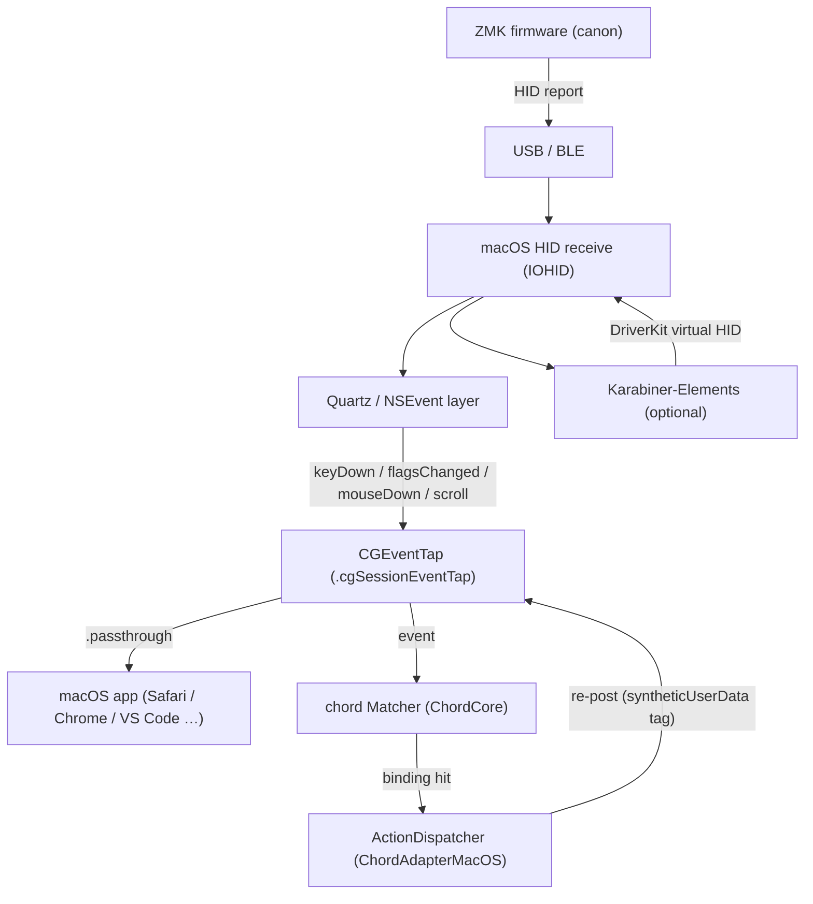
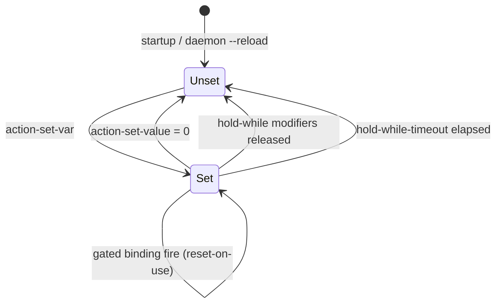
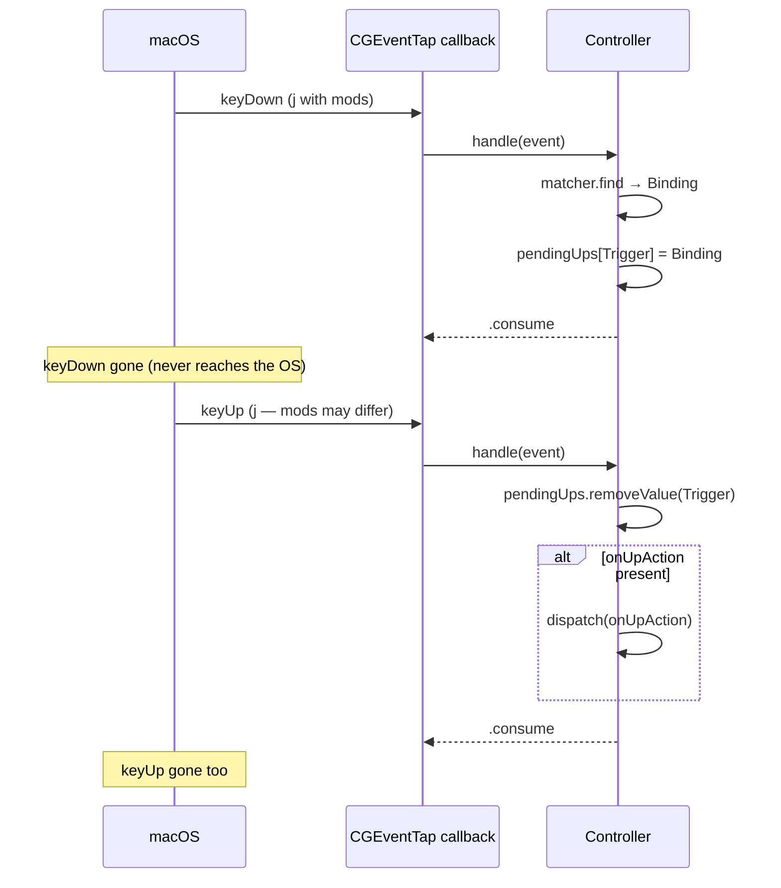

# chord ubiquitous language — Glossary

The **canonical vocabulary** of the chord project. Design discussions, PR
reviews, code comments, and documentation all follow the terms and spellings
in this file.

Every drift that calls one concept by two names (a bare "alias" that could
mean input or action, "state-store" mixed with "variables", …) inflates the
cost of agreement. This dictionary exists to kill that at the root.

## Operating rules

1. **When a code change coins / renames / re-defines a term, update this file
   in the same PR** (per the PR template checkbox).
2. For the **schema contract** (`docs/schema/chord.bindings.v4.json`) enums,
   **adding values is forward-compatible**; renaming an existing value is the
   signal for a schema version bump.
3. Keep **English names 1:1 with code identifiers**. Swift types stay
   CamelCase, TOML tokens stay kebab-case. **Descriptions are English**
   (fleet [doc-consistency policy](https://github.com/akira-toriyama/.github/blob/main/docs/doc-consistency-policy.md)).
4. The "**Don't call it:**" field is the **immediate NG-word list for PR
   review** — cite it when flagging a comment.

---

## Architecture layers

chord sits **on CGEventTap (above Quartz)**. Start with the picture of its
neighbors above and below:


```mermaid
flowchart TB
  app["macOS app (Safari / Chrome / VS Code …)"]
  quartz["Quartz / NSEvent layer"]
  tap["CGEventTap (.cgSessionEventTap)"]
  matcher["chord Matcher (ChordCore)"]
  dispatcher["ActionDispatcher (ChordAdapterMacOS)"]
  os_hid["macOS HID receive (IOHID)"]
  ble_usb["USB / BLE"]
  zmk["ZMK firmware (canon)"]
  karabiner["Karabiner-Elements (optional)"]

  zmk -->|"HID report"| ble_usb
  ble_usb --> os_hid
  os_hid --> karabiner
  karabiner -->|"DriverKit virtual HID"| os_hid
  os_hid --> quartz
  quartz -->|"keyDown / flagsChanged / mouseDown / scroll"| tap
  tap -->|"event"| matcher
  matcher -->|"binding hit"| dispatcher
  dispatcher -->|"re-post (syntheticUserData tag)"| tap
  tap -->|".passthrough"| app
  app
```

- **ZMK firmware** is chord's upstream (= the "atomic chord" emitter). See §6
- **CGEventTap** is chord's entrance and exit (posted events re-enter). See §5
- **Matcher** / **Action** / **Binding** are ChordCore's pure logic. See §1

---

## 1. Core types (Swift)

### Modifiers

The modifier-key set, a UInt16 `OptionSet`. **Two tiers**:

- **any-side** (`.cmd`, `.opt`, `.ctrl`, `.shift`, `.fn`): either side
- **strict-side** (`.lcmd`, `.rcmd`, `.lopt`, `.ropt`, `.lctrl`, `.rctrl`,
  `.lshift`, `.rshift`): that side required
- **`.hyper`** is sugar for `cmd + opt + ctrl + shift` (any-side only)

**Events carry strict-side bits only.** Any-side bits appear only on the
binding side (the matcher's `matches(event:)` does the flexible match).

`isStillHeld(in:)` is distinct from `matches(event:)`: it **tolerates extra
modifiers**, for the `hold-while` lifecycle.

- code: [Sources/ChordCore/Models.swift](../Sources/ChordCore/Models.swift) `Modifiers`
- schema: `modifier_token` / `modifier_sides` (frozen)
- **Don't call it**: modifier-mask, modifier-set (fine as descriptive prose;
  the concept name is Modifiers)

### Trigger

The **kind of input event** that fires a binding. An algebraic data type:

- `.key(UInt16)` — a keyboard key (keycode)
- `.mouseButton(MouseButton)` — a mouse button
- `.scroll(ScrollDirection)` — a scroll-wheel direction
- `.anyKey` — the wildcard. **Legal only in [[fallbacks]]**
- `.modifiersOnly` (chord 0.9.0+) — no primary key; fires on the entry/exit
  transition of a modifier mask
- `.vkey(UInt8)` (chord 0.10.0+) — a vendor-HID v-key: the selector id
  (1–255) canon sends via `&vkey <id>`. Carries no modifiers; referenced by a
  bare `input = "NAME"` through [`[v-key-aliases]`](#sections). See §5
  [VKeyHIDSource](#vkeyhidsource) / §6
- `.anyVKey` (chord 0.10.0+) — the v-key wildcard (`input = "v-key"`).
  **Legal only in [[fallbacks]]**; matches every unassigned v-key

- code: [Sources/ChordCore/Models.swift](../Sources/ChordCore/Models.swift) `Trigger`
- schema: `trigger.kind` (frozen — §3)
- **Don't call it**: input (confusable with the TOML config key),
  primary-token. The v-key's concept name is **v-key** (hyphenated, in
  TOML/prose); the code identifier is **vkey** (`Trigger.vkey` /
  `VKeyHIDSource`). "original key" is a descriptive phrase, not a concept name

### MouseButton / ScrollDirection

| Type | Values |
|---|---|
| `MouseButton` | `left`, `right`, `middle`, `side1`, `side2`, `other5`, `other6`, `other7` |
| `ScrollDirection` | `up`, `down`, `left`, `right` |

`side1` / `side2` are the "back" / "forward" buttons of an ordinary mouse.

- code: [Sources/ChordCore/Models.swift](../Sources/ChordCore/Models.swift)

### Action

The **side effect** when a binding hits.

| Case | Behavior |
|---|---|
| `.keys(Modifiers, UInt16)` | post a synthetic key event |
| `.shell(String)` | run a command via `/bin/zsh -l -c` |
| `.noop` | absorb the event, nothing else |
| `.setVariable(name, value)` | write a state-var |
| `.toggleVariable(name)` | flip a state-var 0↔1 (chord 0.9.0+) |
| `.dragScroll(DragScrollSpec)` | open [drag-scroll](#drag-scroll) for the length of the press (chord 3.0.0+) |

A binding holds one `action` plus **`extraDownActions[]`** (v0.4.0+ —
`action-shell + action-keys` firing together).

- code: [Sources/ChordCore/Models.swift](../Sources/ChordCore/Models.swift) `Action`
- schema: `action.kind` (frozen — §3)
- **Don't call it**: action-kind (invites confusion with the TOML config's
  `action-*` prefix; the concept name is Action)

### Condition

The **state-gate predicate** on a binding's firing. Two forms:

- `.variable(name: String, equals: Int)` — single-variable equality (v2)
- `.conjunction([Condition])` — an AND gate over 2+ entries (chord 0.9.0+).
  Built from the `when-vars = { a = 1, b = 2 }` inline table. On the wire it
  serializes as `kind: "all"` + recursive `conditions[]`.

OR / NOT are deliberately out (avoiding an expression grammar). Issue #19,
which considered `a == 1 && b == 2` for the future, was resolved by shipping
`when-vars`.

- code: [Sources/ChordCore/Models.swift](../Sources/ChordCore/Models.swift) `Condition`
- **Don't call it**: state-predicate, when-var-clause

### Binding

**One line**: trigger + modifiers + optional `apps` → action. Carries the
runtime fields (`action`, `condition`, `holdWhile`, `holdWhileTimeoutMs`,
`onUpAction`, `extraDownActions`, `inputSource`, `passthrough`,
`repeatStrategy` — the last three chord 0.9.0+) and the metadata fields
(`inputRaw`, `actionRaw`, `aliasName`, `sourceLine`).

The metadata is **ignored by the Matcher**; only `config --show --json` uses
it.

- code: [Sources/ChordCore/Models.swift](../Sources/ChordCore/Models.swift) `Binding`

### StateSnapshot

A **value-type copy** of [VariableStore](#variablestore)'s `[String: Int]`
variable store, carried on the Event so the tap thread reads it lock-free.
**unset == 0**.

- code: [Sources/ChordCore/Models.swift](../Sources/ChordCore/Models.swift) `StateSnapshot`
- **Don't call it**: state-dict, state-store (that names the container)

### ChordConfig / ChordConfig.Options

The **whole-program configuration** parsed from `config.toml`.

```
ChordConfig
├── options          (passthroughUnmatched, excludeApps, fnAutoArrows)
├── bindings         [Binding]
├── fallbacks        [Binding]   ← the one place .anyKey triggers are allowed
├── actionAliases    [String: String]
└── inputAliases     [String: String]
```

`fnAutoArrows` (chord 0.8.0+): when true (the default), matching skips the
`fn` comparison for the arrow / nav keys (the 9 keys in
[KeyCodes.fnAutoNavKeycodes](../Sources/ChordCore/KeyCodes.swift)) —
accommodating macOS always stamping `NSEventModifierFlagFunction` on arrows.

- code: [Sources/ChordCore/Models.swift](../Sources/ChordCore/Models.swift) `ChordConfig`

---

## 2. Config concepts (the TOML layer)

The tokens users write in `config.toml`. All **frozen** (a rename is a schema
major bump = v4).

### Sections

| Section | Role |
|---|---|
| `[options]` | global settings (`passthrough-unmatched`, `exclude-apps`, `fn-auto-arrows`). chord 0.9.0+ surfaces unknown keys as an `unknown-option-key` warning (no silent drop) |
| `[[bindings]]` | ordinary bindings (document order, first-match-wins) |
| `[[fallbacks]]` | bindings evaluated only when every [[bindings]] entry missed. The one place the `*` wildcard is allowed |
| `[[sequence]]` | leader-key sugar (chord 0.7.0+): `prefix` + child `[[sequence.bindings]]` + `timeout-ms`, **expanded at parse time into state-var bindings**. See §4 [sequence (leader-key sugar)](#sequence-leader-key-sugar) |
| `[[remap]]` | 1:1 remap sugar (chord 0.8.0+): `modifiers` + `map = { k1 = "a", k2 = "b" }` expands at parse time into N `.keys` bindings |
| `[[bindings.per-app]]` | per-app branching sugar (chord 0.8.0+): nested AoT under a `[[bindings]]` parent; each child expands to a binding with `apps = [bundle-id]` |
| `[action-aliases]` | the `@name → shell command` substitution table |
| `[input-aliases]` | the `$name → "mod1 + mod2"` substitution table |
| `[v-key-aliases]` | the `NAME → vendor-HID id (1–255)` substitution table (chord 0.10.0+). Bindings reference it by bare `input = "NAME"` (no `$`). Names are case-insensitive, first-wins; shadowing a builtin key/modifier/`v-key` wildcard is rejected |

### Per-binding fields

| Token | Meaning | Notes |
|---|---|---|
| `input` | string form of trigger + modifiers | `"$ULTRA_LL - c"` `"mouse.side1"` `"ctrl - scroll.up"` |
| `action-shell` | shell command | `@name` references an alias |
| `action-keys` | synthetic-key string | `"cmd + shift - tab"` |
| `action-noop` | true = absorb only | |
| `action-set-var` | variable name to write | |
| `action-set-value` | value to write (default 1; 0 clears) | |
| `action-toggle-var` | flip 0↔1 on each press (chord 0.9.0+) | mutually exclusive with a value, the hold-while* family, and on-up |
| `action-hold-var` | auto-set 1 on down, 0 on the paired up (chord 0.9.0+) | owns an implicit on-up; mutually exclusive with other on-up |
| `action-mission-control` | `"show-all-windows"` / `"show-app-windows"` (chord 0.9.0+) | desugars to the macOS default shortcut (Ctrl+↑ / Ctrl+↓) |
| `action-screenshot` | `"selection"` / `"screen"` (chord 0.9.0+) | desugars to the macOS default (Cmd+Shift+4 / Cmd+Shift+3) |
| `action-spotlight` | `true` opens Spotlight (chord 0.9.0+) | desugars to the macOS default (Cmd+Space) |
| `when-var` | variable name gating the firing | the compared value is `when-var-value` (default 1) |
| `when-vars` | multi-variable AND gate (chord 0.9.0+) | `{ a = 1, b = 2 }` inline table; mutually exclusive with `when-var`; one entry collapses to `.variable` |
| `hold-while` | keep the var only while modifiers are held | mutually exclusive with `hold-while-timeout` |
| `hold-while-timeout` | clear the var after N ms of inactivity | mutually exclusive with `hold-while` |
| `action-*-on-up` | action fired on the paired key-up | `action-keys-on-up` etc. |
| `apps` | bundle-id glob array | `["*"]` is treated as nil; `"!com.example"` excludes |
| `input-source` | macOS keyboard input-source id glob array (chord 0.9.0+) | same semantics as `apps`; a lone string sugars to a 1-element array |
| `passthrough` | `true` also lets the original event through to the OS (chord 0.9.0+) | allowed only with `action-shell` / `action-set-var` / `action-toggle-var`; mutually exclusive with `action-keys` / `on-up` / `noop` |
| `repeat` | typematic autorepeat strategy (chord 0.9.0+) | `"fire-each"` (default) / `"ignore"` (fire once) / `"passthrough"` (fire, then let repeats through) |

### Reference syntax

| Notation | Meaning | Where it appears |
|---|---|---|
| `@name` | action-alias reference (for argument-less aliases) | `action-shell` values |
| `@name(arg1, "arg 2")` | action-alias call with arguments (chord 0.9.0+): **literal substitution** into the alias body's `{{1}}` `{{2}}` … placeholders (no escaping; quoting is the user's job) | `action-shell` values |
| `$name` | input-alias reference | `input` values |
| `NAME` (bare) | v-key-alias reference (no `$`; a complete trigger by itself) | `input` of `[[bindings]]` / `[[fallbacks]]` |
| `*` | wildcard primary key | `input` of `[[fallbacks]]` only |
| `v-key` / `vkey` | any-vkey wildcard (`.anyVKey`) | `input` of `[[fallbacks]]` only |
| `keycode-NN` | escape hatch to a raw `CGKeyCode` | the key part of `input` / `action-keys` |

**Don't call it**:
- Never call `[action-aliases]` ↔ `[input-aliases]` a bare "alias" —
  **always prefix "input" / "action"**. This confusion recurs.
- `[aliases]` (the pre-v0.5 name) is dead — use `[action-aliases]`.
- `$prefix` names the notation (alias-reference syntax), not the concept. The
  concept name is **input-alias**.
- Don't conflate `[v-key-aliases]` ↔ `[input-aliases]`: the former names a
  **vendor-HID id** (bare reference), the latter a **modifier set** (`$`
  reference).

---

## 3. Schema enum values (frozen)

The enum values of `docs/schema/chord.bindings.v4.json` (v1 and v3 are kept
for history; no separate v2 file was published). **Every rename is a schema
major bump.** Additions are forward-compatible (existing consumers are expected to
tolerate unknowns).

### `trigger.kind`

| Value | Meaning |
|---|---|
| `"key"` | keyboard key (carries keycode) |
| `"mouseButton"` | mouse button |
| `"scroll"` | scroll wheel |
| `"anyKey"` | wildcard ([[fallbacks]] only) |
| `"modifiersOnly"` | modifier-mask-only trigger, no primary key (chord 0.9.0+) |
| `"vkey"` | vendor-HID v-key: `name` = `"0x%02X"`, `keycode` = id (1–255) (chord 0.10.0+) |
| `"anyVKey"` | v-key wildcard ([[fallbacks]] only) (chord 0.10.0+) |

### `action.kind`

| Value | Meaning |
|---|---|
| `"keys"` | post synthetic keys |
| `"shell"` | shell command |
| `"noop"` | absorb only |
| `"set-variable"` | write a state-var (v2+) |
| `"toggle-variable"` | flip a state-var 0↔1 (chord 0.9.0+, [action-toggle-var]) |
| `"drag-scroll"` | pointer motion → scroll while held (chord 3.0.0+, `action-drag-scroll`); carries the nested `drag_scroll` object |

### `modifier_sides`

| Value | Meaning |
|---|---|
| `"absent"` | both sides unpressed |
| `"any"` | either side held |
| `"left"` | left side only |
| `"right"` | right side only |
| `"both"` | both sides held |

### `modifier_token`

any-side: `"cmd"`, `"opt"`, `"ctrl"`, `"shift"`, `"fn"`
strict-side: `"lcmd"`, `"rcmd"`, `"lopt"`, `"ropt"`, `"lctrl"`, `"rctrl"`, `"lshift"`, `"rshift"`

### `ConfigWarning.Kind`

| Value | Raised when |
|---|---|
| `"config-not-found"` | config file missing (non-fatal) |
| `"missing-input"` | a binding line lacks `input` |
| `"missing-action"` | a binding line lacks any action-* |
| `"unknown-input-token"` | a typo in a modifier/key name |
| `"action-keys-parse-error"` | the `action-keys` string fails to parse |
| `"action-keys-delay-parse-error"` | `action-keys-delay-ms` is not a positive integer |
| `"drag-scroll-parse-error"` | an `action-drag-scroll*` key is malformed, combined with another action, or on a trigger with no paired release |
| `"action-alias-non-string"` | an `[action-aliases]` value is non-string |
| `"undefined-action-alias"` | `@name` is not in `[action-aliases]` |
| `"input-alias-non-string"` | an `[input-aliases]` value is non-string |
| `"input-alias-shadows-modifier"` | an alias name collides with a builtin modifier |
| `"input-alias-invalid-body"` | an `[input-aliases]` value fails to parse |
| `"undefined-input-alias"` | `$name` is not in `[input-aliases]` |
| `"condition-parse-error"` | invalid `when-var` |
| `"hold-while-parse-error"` | invalid `hold-while` / `hold-while-timeout` |
| `"action-set-parse-error"` | invalid `action-set-var` / `action-set-value` |
| `"sequence-parse-error"` | an invalid `[[sequence]]` line, or a regular binding colliding with a sequence prefix (chord 0.7.0+) |
| `"remap-parse-error"` | an invalid `[[remap]]` line (missing modifiers, non-inline-table map, non-string values, …) (chord 0.8.0+) |
| `"per-app-parse-error"` | an invalid `[[bindings.per-app]]` line (missing bundle-id, mutual-exclusion violation with `apps`) (chord 0.8.0+) |
| `"action-alias-call-error"` | `@name(args)` with missing arguments / unparsable args (chord 0.9.0+) |
| `"unknown-option-key"` | an unrecognized key inside `[options]` (typo detection; chord 0.9.0+) |
| `"unknown-key"` | a key unknown to the descriptor on a `[[bindings]]` / `[[fallbacks]]` / `[[sequence]]` / `[[remap]]` (and nested `per-app` / `sequence.bindings`) line (typos like `actoin-shell`), **or a typo in a top-level section header itself (`[[bindigs]]` / `[optoins]`)**. Either way the runtime silently ignores it; `--strict` exits 1. The known catalog (section names + each section's keys) is the same `ChordConfigSchema` descriptor that drives `--emit-schema` (#52-bounded) |
| `"duplicate-binding-name"` | multiple user-named `[[bindings]]` lines share a name (synthetic `binding-N` names excluded) |
| `"v-key-alias-invalid"` | a `[v-key-aliases]` value is non-integer / out of range (outside 1–255) / a name shadows a builtin key, modifier, or the `v-key` wildcard (chord 0.10.0+) |
| `"field-type-mismatch"` | an optional `[options]` / `[[bindings]]` field **exists but has the wrong TOML type** (e.g. `passthrough = "true"`, `input-source = 3`). The loader reads via `?.asBool` / `?.asArray`, so a mistyped field silently skips → the default stays and the field "does nothing". A non-string element in an array field (silently dropped by compactMap) reports one entry under the same kind. `--strict` exits 1 (chord 0.10.0+) |
| `"other"` | future catch-all |

---

## 4. State lifecycle

The v2 state machine is a deliberately narrow surface: **flat
`[String: Int]` + single-variable equality (or a `when-vars` AND
conjunction)**. A variable's lifetime has three options:


```mermaid
stateDiagram-v2
  [*] --> Unset: startup / daemon --reload
  Unset --> Set: action-set-var
  Set --> Unset: action-set-value = 0
  Set --> Unset: hold-while modifiers released
  Set --> Unset: hold-while-timeout elapsed
  Set --> Set: gated binding fire (reset-on-use)
```

### state-var

An entry in `VariableStore`'s `[String: Int]` store. **unset = 0**.
`Condition.variable(name, equals: 0)` is the idiom for "mode cleared".
Writes happen via `action-set-var` (+ `action-set-value`) /
`action-toggle-var`.

The store itself is owned by **ChordCore's [VariableStore](#variablestore)**;
the Controller drives it from the tap thread (`set` / `toggle` / `snapshot` /
`clearStale` / `extendTimer` / `reset`).

- code: [Sources/ChordCore/VariableStore.swift](../Sources/ChordCore/VariableStore.swift) `VariableStore`
- **Don't call it**: variable (a generic word, collides constantly),
  state-store (fine for the container; the concept name is state-var)

### hold-while-modifier-bound

The `hold-while = "cmd + opt"` form: **ties a variable's lifetime to the OS
modifier hold**. The var clears the moment every listed modifier is released.
`Modifiers.isStillHeld(in:)` is permissive (extra modifiers tolerated), so
additionally pressing shift does not end it.

### hold-while-timeout

The `hold-while-timeout = 1500` form: ties the lifetime to an **inactivity
timer**. Every fire of a gated binding resets the timer (= **reset-on-use /
B-α**).

When a ZMK macro emits atomically and releases its modifiers immediately,
a `hold-while` lifetime dies within moments — which is why the **timeout
family is the practical choice for canon use**.

### reset-on-use (B-α)

Vim's `timeoutlen` semantics: every fire of a binding gated by `when-var`
resets the `hold-while-timeout` timer. **Adopted in chord 0.4.0.**

### sequence (leader-key sugar)

A `[[sequence]]` section declares **prefix + child bindings + timeout-ms** in
one block and expands at parse time into ordinary bindings (chord 0.7.0+):

- **the prefix binding**: an unconditional binding with
  `action-set-var = "_seq_<name>"`, `hold-while-timeout = <timeout-ms>`
- **child bindings**: bindings gated by `when-var = "_seq_<name>"`. Their
  `input` is written **primary-only** and inherits the prefix's modset

```toml
[[sequence]]
name = "j-layer"
prefix = "$ULTRA_LL - j"
timeout-ms = 1500

  [[sequence.bindings]]
  input = "k"
  action-keys = "return"

  [[sequence.bindings]]
  input = "l"
  action-keys = "backspace"
```

The Matcher / Controller only ever see the expanded bindings (= no new
runtime concept). The `_seq_` prefix is a **reserved namespace**: user
bindings may not write `action-set-var = "_seq_..."` (rejected at load).

When a prefix collides with an ordinary `[[bindings]]` entry on
`(trigger, modifiers)`, **the ordinary binding is dropped and the sequence
wins** (with a warning).

- code: [Sources/ChordCore/Config.swift](../Sources/ChordCore/Config.swift) `parseSequences`
- config: `[[sequence]]` + `[[sequence.bindings]]`
- runtime concept: none (= already expanded into ChordConfig.bindings)
- **Don't call it**: leader, layer, modal-state (fine in prose; the concept
  name is sequence)

### pendingUps

The Controller's `[Trigger: Binding]` table — internal state for the
`B1 contract` (paired down/up consume). Registered when a down is consumed;
when the matching up arrives, the entry is removed, `onUpAction` fires (if
any), and the up is consumed too.

**The key is Trigger alone, not (Trigger, Modifiers)**: users often release
modifiers between down and up (`cmd` first, `j` later), so the event's
modifier mask can differ between the two halves.

- code: [Sources/ChordApp/Controller.swift](../Sources/ChordApp/Controller.swift) `pendingUps`
- **Don't call it**: pending-releases, up-queue, release-map

### paired down/up consume (B1 contract)


```mermaid
sequenceDiagram
  participant OS as macOS
  participant Tap as CGEventTap callback
  participant Ctrl as Controller
  OS->>Tap: keyDown (j with mods)
  Tap->>Ctrl: handle(event)
  Ctrl->>Ctrl: matcher.find → Binding
  Ctrl->>Ctrl: pendingUps[Trigger] = Binding
  Ctrl-->>Tap: .consume
  Note over OS: keyDown gone (never reaches the OS)

  OS->>Tap: keyUp (j — mods may differ)
  Tap->>Ctrl: handle(event)
  Ctrl->>Ctrl: pendingUps.removeValue(Trigger)
  alt onUpAction present
    Ctrl->>Ctrl: dispatch(onUpAction)
  end
  Ctrl-->>Tap: .consume
  Note over OS: keyUp gone too
```

Swallow the down, swallow the up = never leave the OS a "phantom key-up".
The point: **the pair holds as long as the trigger matches, even when the
modifiers differ between down and up**.

---

## 5. Runtime / Adapter

Concepts on the concrete macOS side.

### CGEventTap

Quartz Core Graphics' event tap. chord attaches to **`.cgSessionEventTap`**
with **head-insert**. The mask includes `keyDown | keyUp | flagsChanged |
mouseDown family | scrollWheel`.

- code: [Sources/ChordAdapterMacOS/EventTap.swift](../Sources/ChordAdapterMacOS/EventTap.swift)
- **Don't call it**: tap-subsystem (says nothing concrete), event-tap
  (colloquial — fine mid-sentence, but the concept name is CGEventTap)

### syntheticUserData

The **sentinel value** `0x43484F524400` (= ASCII "CHORD\0") the
ActionDispatcher stamps on every synthetic event it posts, written to
`kCGEventSourceUserData`. On re-entry the tap sees it and **short-circuits
our own synthetic events before the matcher** — without it, an infinite
loop.

- code: [Sources/ChordAdapterMacOS/EventTap.swift:23](../Sources/ChordAdapterMacOS/EventTap.swift) `syntheticUserData`
- **Don't call it**: marker, tag (fine in prose; the concept name is
  syntheticUserData)

### NX_DEVICE bits

The **device-dependent modifier flags** (L/R distinction) hiding in
`CGEventFlags`' raw value — `0x00000008` = lcmd etc., from
`IOKit/hidsystem/IOLLEvent.h`. chord reads them to build the strict-side
bits (when only the abstract mask is set, it rounds to left as the default).

- code: [Sources/ChordAdapterMacOS/EventTap.swift](../Sources/ChordAdapterMacOS/EventTap.swift) `readModifiers`

### autorepeat (`kCGKeyboardEventAutorepeat`)

The CGEvent field marking held-key repeat key-downs. Shipped in chord 0.9.0+
as the per-binding `repeat` property (= `Binding.repeatStrategy` /
[RepeatStrategy](../Sources/ChordCore/Models.swift)): `"fire-each"`
(default) / `"ignore"` (fire once, consume repeats) / `"passthrough"` (fire,
then let repeats through to the OS).

- code: [Sources/ChordCore/Models.swift](../Sources/ChordCore/Models.swift) `RepeatStrategy`

### frontmost

The **frontmost app's bundle id** as reported by NSWorkspace. A binding's
`apps` filter glob-compares against it.

- code: [Sources/ChordAdapterMacOS/FrontmostTracker.swift](../Sources/ChordAdapterMacOS/FrontmostTracker.swift)
- **Don't call it**: active-app, front-app

### AX permission (Accessibility grant)

The permission CGEventTap requires: System Settings → Privacy & Security →
Accessibility. **TCC binds to the code-signing identity**, so with ad-hoc
signing the grant falls off on every rebuild (`setup-signing-cert.sh`
creates a persistent cert as the fix).

- code: [Sources/ChordAdapterMacOS/Permissions.swift](../Sources/ChordAdapterMacOS/Permissions.swift)
- **Don't call it**: a11y (colloquial — fine in prose), accessibility (a
  generic word; the concept name is AX permission)

### Input Monitoring (kTCCServiceListenEvent)

The permission the v-key vendor-HID read (IOHIDManager) requires
(chord 0.10.0+). **A separate TCC grant from AX permission**: System
Settings → Privacy & Security → Input Monitoring. Checked with
`IOHIDCheckAccess(kIOHIDRequestTypeListenEvent)`, prompted with
`IOHIDRequestAccess(...)`. **Requested only when a v-key binding exists**
(`Controller.maybeStartVKeySource`); non-v-key users are never asked.
Surfaced by `config --doctor`'s `input monitoring:` line and
`query --status`'s `input_monitoring_granted`. Holding AX does not cover it.

- code: [Sources/ChordAdapterMacOS/Permissions.swift](../Sources/ChordAdapterMacOS/Permissions.swift) `isInputMonitoringTrusted`
- **Don't call it**: listen-event grant (the concept name is Input
  Monitoring), IM

### VKeyHIDSource

The **IOHIDManager**-based input source that reads v-keys (chord 0.10.0+).
Matches the dongle by VID/PID (`0x1D50`/`0x615E`) and reads **only** the
1-byte selector of report ID `0x20` (canon's vendor usage page `0xFF31`) —
never ordinary keyboard reports. Selector `1–255` = press, `0` = release.
**Does not conform to `EventSource`** (vendor reports never ride the tap, so
a consume/pass return value would be meaningless). The edge detection
(press/release latch math) lives in ChordCore's pure type
[VKeyEdgeTracker](#vkeyedgetracker); `VKeyHIDSource` just streams raw
selectors.

- code: [Sources/ChordAdapterMacOS/VKeyHIDSource.swift](../Sources/ChordAdapterMacOS/VKeyHIDSource.swift)
- schema: `trigger.kind = "vkey"` / `"anyVKey"` (§3)
- **Don't call it**: HID tap, vkey-tap (it is not a CGEventTap),
  original-key-source

### drag-scroll

The mode `action-drag-scroll = true` opens (chord 3.0.0+): while the
binding's trigger is **held**, chord pins the cursor and converts relative
pointer motion into scroll events. The only action with a **duration** —
key-down opens it, the paired key-up closes it — which is why the
Controller owns it rather than the dispatcher, and why triggers with no
paired release (`scroll.*`, a bare modifier chord) are rejected at load.

Explicitly **not a gesture**: no path, shape, or history is examined (see
[non-goals.md §7](non-goals.md)). Tuned by the sibling keys
`action-drag-scroll-speed` / `-axis` / `-invert` / `-max-ms`.

- code: [Sources/ChordCore/DragScroll.swift](../Sources/ChordCore/DragScroll.swift)
  `DragScrollSpec` / [Controller+DragScroll.swift](../Sources/ChordApp/Controller+DragScroll.swift)
- schema: `action.kind = "drag-scroll"` + the `drag_scroll` object (§3)
- **Don't call it**: drag gesture, pan, grab-scroll (chord has exactly one
  spelling, and "gesture" is the thing this deliberately is not)

### cursor pin

Holding the cursor still during [drag-scroll](#drag-scroll) by warping it
back to the **anchor** (the position latched when the mode opened) on every
motion event. Consuming motion events does *not* stop the cursor — the
WindowServer moves the pointer from the HID stream, upstream of the session
tap — so the warp is what makes it a scroll instead of a drag.
`CGWarpMouseCursorPosition` generates no tap-visible event of its own
(measured: 100 warps with the mouse still produced 0 `mouseMoved`), so the
pin cannot feed itself. Chosen over
`CGAssociateMouseAndMouseCursorPosition(false)` because disassociation is
process-external global state: a crash mid-drag would leave the pointer
dead until logout.

- code: [Sources/ChordAdapterMacOS/MotionTap.swift](../Sources/ChordAdapterMacOS/MotionTap.swift)
- **Don't call it**: cursor lock, pointer capture, mouse grab

### MotionSource

The seam carrying **relative pointer motion**, separate from
[EventSource](#eventsource) on purpose: motion is continuous, never
reaches the Matcher, and while armed is consumed unconditionally, so a
consume/pass return value would be meaningless. Installed **disarmed** and
armed only for the span a drag-scroll trigger is held — and not installed at
all unless the config declares such a binding (same gated shape as
[VKeyHIDSource](#vkeyhidsource)). Production conformer:
`MacOSMotionSource`, a second CGEventTap over `mouseMoved` + the three
`*Dragged` variants.

- code: [Sources/ChordCore/MotionSource.swift](../Sources/ChordCore/MotionSource.swift)
- **Don't call it**: motion tap (that is the macOS *conformer*, not the
  seam), pointer source

### VKeyEdgeTracker

The pure ChordCore type holding the v-key press/release **edge / latch
math** (unit-tested). A release report carries no id, so a latch remembers
which `.vkey(id)`'s `.up` to synthesize. Repeats of the same id are ignored;
an `A → B` roll releases A before pressing B. The Controller just feeds raw
selectors to `events(for:)`; no HID-dependent code here.

- code: [Sources/ChordCore/VKeyEdgeTracker.swift](../Sources/ChordCore/VKeyEdgeTracker.swift) `VKeyEdgeTracker`
- **Don't call it**: vkey-state-machine

### VariableStore

The state-var store proper (extracted from the Controller's file-private
globals in the chord 0.10.0 era). **ChordCore owns it, the Controller drives
it.** A `final class` (`@unchecked Sendable`) guarding a flat
`[String: Int]` with its own `NSLock`. Public surface: `snapshot()` (tap
thread reads) / `set(name:value:holdWhile:timeoutMs:)` / `toggle(name:)`
(0↔1 in a single lock window) / `extendTimer(name:)` (B-α reset-on-use) /
`clearStale(currentMods:)` (modifier-release cleanup) / `reset()` (reload
wipe). The B-α inactivity timer goes through an injected `StateScheduler`
(production: a `DispatchSourceTimer` on the serial `"chord.state.timer"`
queue). **Do not replace it with an actor** — the tap thread cannot
`await`.

- code: [Sources/ChordCore/VariableStore.swift](../Sources/ChordCore/VariableStore.swift) `VariableStore`
- **Don't call it**: state-machine, variable-actor

### EventSource

The **callback-based** protocol forming the seam between ChordCore and the
Adapter. Must not become an AsyncStream (the tap callback requires a
synchronous return).

- code: [Sources/ChordCore/EventSource.swift](../Sources/ChordCore/EventSource.swift)
- **Don't call it**: input-source (collides with the existing macOS IME
  term, used for that in issue #30), event-driver

### DNC (Distributed Notification Center)

macOS's IPC channel `com.chord.app.control`. The client sends reload / quit
/ pause / resume to the daemon fire-and-forget. **There is no reply path**,
so daemon-side status is read via the `/tmp/chord.status` file.

- code: [Sources/ChordApp/Control.swift](../Sources/ChordApp/Control.swift)
- **Don't call it**: dnc (abbreviating is fine, but the formal name is DNC)

---

## 6. ZMK / canon side

Names from chord's upstream (= the keyboard firmware). They appear verbatim
inside chord configs, hence their place in the glossary.

### canon

The user's ZMK firmware repository
([akira-toriyama/canon](https://github.com/akira-toriyama/canon)), for the
Cyboard Imprint split keyboard. The origin of chord's configuration (e.g.
the 4 modset names come from canon's `eiji_macros.dtsi`).

### &vkey / v-key (vendor-HID)

canon's ZMK behavior `&vkey <id>` (chord 0.10.0+): an "original key" that
collides with no existing key input, sending a 1-byte selector (id 1–255) on
vendor usage page `0xFF31` / report ID `0x20`. chord receives it via §1's
`.vkey(UInt8)` trigger + §5's [VKeyHIDSource](#vkeyhidsource). canon's
`config/vkey-aliases.toml` (generated from the keymap's `&vkey <id>` uses by
`scripts/gen-vkey-aliases.py` = single source) supplies the
`[v-key-aliases]` block, which the user pastes into their chord config. To
chord it is an input source; the names (`TU_LL_C` etc.) are canon's.

- **Don't call it**: original key (descriptive phrase; the concept name is
  v-key), custom keycode

### ULTRA_LL / MIRACLE_LM / MEGA_RM / WONDER_RR

The 4 ZMK macro names, each a different combination of three right-hand
modifiers:

| Macro | Modifier set |
|---|---|
| `ULTRA_LL` | `rctrl + ralt + rshift` |
| `MIRACLE_LM` | `rctrl + rcmd + rshift` |
| `MEGA_RM` | `rctrl + rcmd + ralt` |
| `WONDER_RR` | `rcmd + ralt + rshift` |

Given logical names in `private_config.toml`'s `[input-aliases]`.

### atomic chord

The behavior of a ZMK macro (or similar) **packing modifiers + primary key
into one HID report**. The modifiers release right after the primary does,
so from chord's side the **modifier hold lasts 1-2ms** — the direct reason
the `hold-while`-based v2 lifecycle fails here, and the motivation for
`hold-while-timeout`.

### F21-F24 (HID 0x70-0x73)

Keys Apple never assigned `kVK_*` constants for. By the convention of
Karabiner and some firmware remappers, keycodes corresponding to HID usage
`0x70-0x73` are used. chord supports them **receive-side only** (emitting is
impossible under CGEvent's constraints — see issue I (skip)).

### ZMK macro

ZMK firmware's mechanism bundling several HID outputs behind one trigger.
To chord it is an "input source", not an internal concept (= it recurs in
chord docs but is not a chord term).

---

## 7. CLI / lifecycle

yabai-style `chord <domain> --<verb> [--mod]` (atelier Phase 3 M4). Bare
`chord` starts the daemon. `--help`/`-h` and `--version`/`-V` are top-level
carve-outs needing no domain.

### `config` domain (standalone — no daemon needed)

| Verb | Behavior | Exit code |
|---|---|---|
| `config --validate` | parse the config, report warnings/drops (accepts `--strict` / `--json`) | 0 / 1 (strict + issues) / 2 (parse error) |
| `config --show` | print the current parse result (accepts `--json` / `--include-dropped`; formerly `--list`) | 0 / 2 |
| `config --doctor` | validate + AX permission + daemon liveness | 0 / 1 (anything NG) |
| `config --emit-schema` | print the config.toml INPUT JSON Schema (Draft-07) to stdout (for taplo completion; generated from the `ChordConfigSchema` descriptor. Regenerate the committed copy with `chord config --emit-schema > config.schema.json`) | 0 |

### `daemon` domain (lifecycle — mostly talks to the daemon over DNC; no daemon is exit 3)

| Verb | Behavior | Exit code |
|---|---|---|
| `daemon --reload` | request a config reload (`--dry-run` diffs without IPC) | 0 / 3 (no daemon) |
| `daemon --quit` | stop the daemon | 0 / 3 |
| `daemon --pause` / `daemon --resume` | make every binding passthrough / restore | 0 / 3 |
| `daemon --toggle` | flip pause/resume based on `/tmp/chord.status` | 0 / 3 |
| `daemon --show` | print the contents of `/tmp/chord.status` (formerly `--status`) | 0 / 3 |
| `daemon --watch` | live per-event trace — truncate `/tmp/chord-watch.log` and `tail -F` it; the daemon writes only while the file exists | 0 / 1 (spawn failure) |
| `daemon --resign` | re-sign + restart Chord.app after a brew sandbox (codesign + restart, not DNC) | 0 (if signing succeeds) |

### `query` domain (live runtime state as JSON — daemon required; no daemon is exit 3)

The structured-read mouth into the daemon's live state, over an **AF_UNIX
req/res socket** (`/tmp/chord-query.sock`) — separate from DNC (write-only)
and the status file. Output is always `chord.query.v1` JSON (distinct from
the parsed config's `chord.bindings.v4`).

| Verb | Behavior | Exit code |
|---|---|---|
| `query --status` | live state (paused / ax-granted / uptime / config-loaded-at) | 0 / 3 (no daemon) |
| `query --vars` | current state-variable values | 0 / 3 |
| `query --loaded-bindings` | binding / fallback / alias counts | 0 / 3 |
| `query --recent-fires [--limit N]` | recently fired bindings (newest first; `--limit N` caps the count = chord's only value-taking modifier) | 0 / 3 |

### Dispatch contract (chord 0.9.0+)

`dispatch(_:)` peels the leading token (the domain noun) and routes via
`dispatchDomain` to the per-domain verb tables (`configVerbs` /
`daemonVerbs` / `queryVerbs`) (`Sources/ChordApp/Main.swift`). The shared
tokenizer **sill `CLIKit`** parses argv (unknown flags are loudly rejected
with a nearest-match hint; `-h`/`-V` carve-out). chord-side policy:

- **Exactly one verb per domain.** Zero or two-plus verbs is exit 2.
- Combining a modifier the verb does not honour is exit 2 (no silent drop).
- A flag from the wrong domain (e.g. `chord config --reload`) or a fully
  unknown flag is CLIKit's unknown-flag, exit 2. Old flat flags (leading
  `-`, e.g. `chord --validate`) also exit 2 and point at the new domain (no
  backward-compat shim).
- Every handler returns a `SubcommandOutcome`; `exit()` is called only in
  `applyOutcome` (keeping dispatch unit-testable). Only bare `chord` (empty
  argv) makes `dispatch` return nil → server mode.

- code: [Sources/ChordApp/Main.swift](../Sources/ChordApp/Main.swift) `dispatch` / `dispatchDomain` / `applyOutcome`
- **Don't call it**: command / option (both generic words, both collide)

### Environment variables

- **`CHORD_DEBUG`** — when set, `Log.debugMode = true`: writes to
  `/tmp/chord.log` plus a stderr mirror. `run.sh` sets it to `=1`; brew /
  raw launches leave it unset and quiet.

### File paths

| Path | Role |
|---|---|
| `/tmp/chord.log` | persistent log; always written, stderr-mirrored under CHORD_DEBUG |
| `/tmp/chord.status` | reverse-direction IPC file for daemon state (complements one-way DNC) |
| `/tmp/chord-loaded.json` | binding snapshot from the last reload; the diff base for `daemon --reload --dry-run` |
| `/tmp/chord-watch.log` | per-event structured log for `chord daemon --watch` (chord 0.9.0+). **File existence = the subscribe signal**; the daemon writes only while it exists; `rm` silences it |

### DNC channel

`com.chord.app.control` — Control.swift posts one of `reload` / `quit` /
`pause` / `resume` in the `name` field.

---

## Entry addition rules

To add a new term:

1. **Update this file in the same PR as the code change.** No catching up
   later (= the PR template's glossary checkbox)
2. Add it to the appropriate section. When it spans sections (e.g. a type +
   a config token), put the entry under the primary one and link from the
   other
3. On a **rename / meaning change** of an existing term, add the old name to
   the `Don't call it:` field (= stops the old name resurfacing in CR)
4. A rename of a **schema enum value** (§3) is always discussed together
   with a `chord.bindings.v4.json` version bump (additions are
   forward-compatible)
5. If a new entry carries `Don't call it:`, **name at least one forbidden
   synonym**. Without an explicit "don't call it this", the drift returns

### Minimal entry format

```markdown
### <CanonicalName>

<A 1-3 line English definition. An example if needed>

- code: [path/to/file.swift](../path/to/file.swift) `Symbol`
- schema: `enum_value` (frozen?)
- **Don't call it**: <forbidden synonym 1>, <forbidden synonym 2>
```

Of `code` / `schema` / `Don't call it`, **omit what does not apply** — but
when omitting `Don't call it`, **self-review that synonym confusion truly
cannot arise**.

---

## Related documents

- [docs/non-goals.md](non-goals.md) — the features chord **deliberately does
  not have**; explains why some concepts never appear in this glossary
- [docs/architecture.md](architecture.md) — the layer structure in detail
- [docs/schema/chord.bindings.v4.json](schema/chord.bindings.v4.json) — the
  live OUTPUT wire-schema contract (cross-referenced with §3 of this file;
  `v1.json` / `v3.json` are history — don't edit them)
- [CLAUDE.md](../CLAUDE.md) — the source for design decisions and
  invariants
